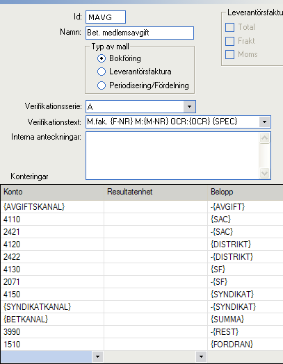
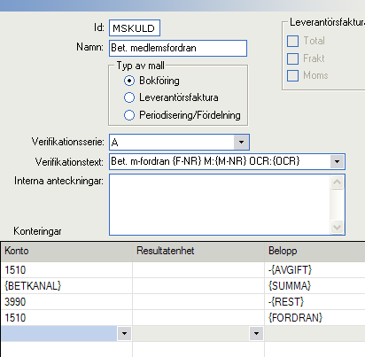

Ekonomifunktionerna
===================

Alla lokala grupper i registret som behöver kunna arbeta med ekonomiska
funktioner (generera fakturor, exportera verifikationer till bokföring osv)
måste skapa en så kallad *bokhållare*. En bokhållare är ett sammansatt objekt
som består av *kontoplan*, *avgiftstabell*, *bokföringskanaler* samt
*konteringsmallar*.

Samtliga delar krävs för att ekonomifunktionerna ska fungera. Att skapa dem kan
vara lite krångligt, men i gengäld behöver de sällan uppdateras.

Börja med att kontakta den systemansvarige för att skapa en standard-bokhållare.

## Bokföringsprogram

Ekonomidelen av registret är skriven för att användas tillsammans med något
fristående bokföringsprogram. Verifikationer exporteras till bokföring i
filformatet [SIE](http://www.sie.se "http://www.sie.se"), vilket är
branschstandard i Sverige. Alla program med stöd för import av SIE-filer är
lämpade för användning tillsammans med registret.

*Men...*

Extra fokus har lagts på interaktionen med bokföringsprogram från
[VISMA](http://www.visma.se/ "http://www.visma.se/"). Speciellt att komma igång
underlättas för den som använder något av VISMA:s program. I det följande kommer
jag även att ge specifika tips och instruktioner riktade till VISMA-serien.

## Flera kassörer?

Det är rekommenderat att varje lokalgrupp endast har en användare med rättigheter att
arbete med ekonomi. I de fall flera användare behövs är det mycket viktigt
att dessa har samma primära system-grupp samt att alla fakturor görs
tillgängliga för användare i denna grupp. Om detta inte görs finns risken att
den ena kassören skapar fakturor som den andra inte kan läsa, vilket i sin tur
leder till att både avprickning mot reskontra och export till bokföring ej
kommer att stämma.

Om ni inte till 100% förstår detta: Kontakta sysadmin innan ni skapar flera
användare som kan arbeta med ekonomin.

## Att avskriva fakturor

Obetalda fakturor kan raderas från registret. Till exempel om en medlem lämnar
organisationen kan inaktuella fakturor behöva tas bort. Ibland kan detta dock
ställa till problem.

När registret tar emot en betalning som är lägre än det fakturerade beloppet så
bokförs mellanskillnaden som en fodring på medlemmen, och en ny faktura
genereras med denna summa. Om den nya fakturan sedan raderas kommer fodringen
att hänga kvar i bokföringen. Systemet kan i detta läge inte hjälpa till att
avskriva fodringen, utan det måste göras manuellt i bokföringen.

Ett liknande problem kan uppstå om exempelvis en medlem lämnar organisationen
med obetalda fakturor och avdelningen väljer att inte kräva in betalning. Ifall
det rör sig om gamla fakturor som redan har rapporterats centralt kan de inte
längre raderas. I detta läge kan administratören välja att markera fakturan som
betald med _0_ kr. För att undvika att en ny faktura genereras ska då
_fakturera fordran_ INTE vara markerad. Fordringen kommer att exporteras till
bokföringen och måste där avskrivas manuellt.

## Kontoplanen #################################################################

För att kunna generera fakturor och verifikationer måste registret innehålla
en kontoplan. För att export av verifikationer ska fungera felfritt måste kontoplanen
i registret vara *exakt* samma som kontoplanen i bokföringsprogrammet. Det
innebär att ett kontos nummer, typ OCH namn måste vara samma.

För att undvika att hamna i en situation där det är oklart vilken kontoplan som
gäller är det rekommenderade arbetssättet att endast redigera kontoplanen i
bokföringsprogrammet, och sedan exportera den till registret.

> I alpha-versionen kommer registret inte heller innehålla stöd för att arbeta
> direkt med kontoplanen.

Registret kan läsa kontoplaner i ett format utvecklat av VISMA. Detta format är
nära knutet till det officiella SIE-formatet, men är inte standard (SIE
innehåller egentligen inte något format för kontoplaner). Det är alltså osäkert
om andra bokföringsprogram än VISMA kan arbeta med kontoplaner i detta format.

Tillsammans med den här guiden bör ni ha fått en kopia av baskontoplanen.
*Baskontoplan.kp*. Det är rekommenderat att utgå ifrån denna när ni utvecklar
kontoplanen för er lokalgrupp. Om ni använder baskontoplanen rakt av behöver
ingenting exporteras till registret, den används som standard.

### Att importera baskontoplanen till VISMA

Att importera en kontoplan i VISMA kan bara göras vid nytt bokföringsår.

Först måste ni kopiera *Baskontoplan.kp* till katalogen för kontoplaner.
Vad den ligger kan variera. Min installation av *VISMA Förening* i 
*Windows XP* använder

> C:\\Documents and Settings\\All Users\\Application Data\\SPCS\\SPCS Förening\\Gemensamma filer\\Kpl\\

Baskontoplanen baseras på EUBAS97. Som standard söker VISMA efter kontoplaner
baserade på BAS2010 eller liknande. Ni måste istället välja EUBAS97 för att
VISMA ska hitta kontoplanen.

När baskontoplanen väl är importerad kan ni omarbeta den efter behov och sedan
exportera den till registret.

## Avgiftstabellen #############################################################

Avgiftstabellerna i registret är hierarkiskt ordnade. Högst upp finns en central
tabell där centrala avgifter per medlem definieras. Under den
centrala tabellen finns distrikten, och under dem lokala avgiftstabeller. Denna
ordning innebär att om de centrala avgifterna ändras så ändras de
automatiskt i distriktens avgiftstabeller, vilket i sin tur gör att de även
ändras lokalt.

På samma sätt ändras distriktens avgifter automatiskt i de lokala
avgiftstabellerna. Kontrollera att rätt distrikt ställts in.

I tabellen kan ni sedan skapa en eller flera avsättningar. Med avsättning
menas en summa som dras från varje inbetald avgift för att användas till något
speciellt ändamål. Vanliga exempel är stridsfond, studiefond och avsättning
till annan grupp.

När ni skapar avsättningar får endast VERSALER användas, ÅÄÖ är ej tillåtna.
Var noga med namnen, de ska senare användas som summa-variabler när ni skapar
konteringsmallar.

Slutligen skapar ni de olika avgiftsklasser ni använder er av. Anger
inkomstintervall, avgift och storlek på avsättningar. Notera att avgiften som
anges är den samlade avgiften. De olika avsättningarna kommer sedan att dras
från varje inbetalda avgift, och den summa ni fritt kan röra er med blir
alltså avgift - avsättningar. (I extrema fall kan denna summa till och med bli
negativ: exempelvis ifall ni sätter er avgift lägre än den centrala avgiften.
Registret innehåller inte några spärrar för detta, det är upp till varje
lokalgrupp att hålla koll på sin avgiftstabell.)

För varje avgiftsklass måste även en konteringsmall anges.

## Bokföringskanaler ###########################################################

Med hjälp av bokföringskanaler länkas data från registret till faktiska konton
i kontoplanen. En inbetalning till plusgirokonto måste exempelvis översättas
till motsvarande bokföringskonto (1920 PlusGiro i baskontoplanen). På samma sätt
måste en medlems grupptillhörigheter länkas till kontoplanens konto för samma
dessa grupper.

Mera specifikt måste dessa bokföringskanaler finnas:

1. Alla avgiftsklasser
1. *K*, *PG*, *BG* samt *AG* (Kontant, PlusGiro, Bankgiro samt Autogiro)
1. Alla grupper som ni gör avsättningar till

Kanaler *K*, *PG*, *BG*, *AG* samt en standarduppsättning avgiftsklasser skapas
automatiskt när ni skapar bokhållare. Dock kan ni behöva ändra dessa så att de
stämmer med kontoplanen. Använder ni baskontoplanen behöver dessa kanaler inte
ändras.

Om ni gör avsättningar till andra grupper måste ni alltid lägga till kanaler för
detta.

## Konteringsmallar ############################################################

Det sista och mest komplicerade steget är att skapa de konteringsmallar
registret använder för att generera verifikationer. Jag kommer börja med att
beskriva konteringsmallarna allmänt, för att sedan specifikt beskriva hur VISMA
hanterar mallar.

Delar av er ekonomi kommer att skötas utanför registret. Och det är fullt
möjligt att ni kommer att bokföra transaktioner manuellt som liknar de registret
hanterar. För att dessa ska bokföras på samma sätt är det önskvärt att samma
konteringsmallar finns i bokföringsprogrammet som i registret. Det
rekommenderade arbetssättet är därför att skapa konteringsmallarna i
bokföringsprogrammet och sedan exportera dem till registret. Detta är dock i
nuläget endast möjligt om ni använder VISMA.

> I alpha-versionen kommer registret inte heller innehålla stöd för att arbeta
> direkt med konteringsmallarna.

Tillsammans med den här guiden bör ni ha fått en fil med standardmallar,
*konteringsmallar.kml*. Denna fil innehåller förslag till konteringsmallar i ett
format specifikt för VISMA. Om ni har möjlighet att importera dessa mallar så
gör det redan nu, då blir det enklare att följa med.

*konteringsmallar.kml* innehåller följande mallar:

* **MSKULD**. Bokför inbetald fordran på medlem. Mer om detta nedan.
* **MAVG**. Standardmall som kan användas för alla avgiftsklasser som
  gör avsättningar till grupp och find och använder sig av baskontoplanen. Det
  rekommenderas att ni använder denna mall som utgångspunkt när ni skapar nya
  mallar.

### Hur konteringsmallarna fungerar

En konteringsmall är en verifikation där vissa delar lämnats tomma. Att omvandla
en konteringsmall till en verifikation innebär att fylla alla tomma platser
med information.

De tomma platserna kan vara en del av verifikationstexten, ett kontonummer eller
en summa.

För att registret ska kunna veta vilken information som ska stoppas in på vilken
plats används så kallade variabler. Istället för att skriva en summa skriver ni
namnet på en variabel. Registret ersätter sedan variabeln med rätt summa.

Variabelnamn måste alltid skrivas med VERSALER (ÅÄÖ är ej tillåtet) och omslutas
av { samt }. Såhär: **{VARIABEL}**

Registret innehåller ett antal fördefinierade variabler som alltid finns
tillgängliga. Se tabell.

Ni kan även använda de avsättningarna från avgiftstabellen. Om ni exempelvis gör
en avsättning till en stridsfond och har döpt denna till *SF* så kan ni för
varje inbetald avgift bokföra avsättningen till stridsfond med hjälp av
summa-variabeln **{SF}**.

Det är mycket viktigt att varje konteringsmall bokför summa-variablerna
**{REST}** och **{FORDRAN}**. Om de utelämnas kommer det inte att gå att bokföra
inbetalningar där den inbetalda summan ej överensstämmer med den förväntade.

Titta gärna på hur standardmallarna är konstruerade.

### Standardvariabler i konteringsmallar

Alla variabelnamn består av VERSALER. ÅÄÖ är ej tillåtet.

Variabel            Typ                 Beskrivning
------------------  ------------------  ----------------------------------------
**AVGIFT**          Summa               Förväntad avgift
**SUMMA**           Summa               Faktiskt inbetald summa
**REST**            Summa               Del av *summa* som överskrider *avgift*
**FORDRAN**         Summa               Del av *summa* som underskrider *avgift*
**CENTRAL**         Summa               Avsättning centrala avgifter
**DISTRIKT**        Summa               Avsättning distriktsavgifter
**BETKANAL**        Kontonummer         Tillgångskonto för den inbetalda summan
**AVGIFTSKANAL**    Kontonummer         Intäktskonto avgiften ska bokföras på
**F-NR**            Verifikationstext   Fakturanummer
**OCR**             Verifikationstext   OCR-nummer
**SPEC**            Verifikationstext   Fakturans specifikation
**M-NR**            Verifikationstext   Medlemsnummer

Utöver detta tillkommer summa-variabler för de avsättningar som definierats i
avgiftstabellen.

### Medlemsfodringar

När en medlem betalar för lite genererar registret automatiskt en ny faktura
för att kräva in den del av avgiften som saknas. För att göra det används
mallen **MSKULD**. Hur standardversionen av **MSKULD** ser ut i VISMA visas
i figur 2.

### Att arbeta med konteringsmallar i VISMA

VISMA kan skapa konteringsmallar av olika typer. Vi är endast intresserade av
mallar för bokföring. När ni skapar en ny mall, se till att typ av mall är
*bokföring*.

Ge varje mall ett unikt ID. Det är detta ID som ska anges när ni länkar
avgiftsklasser till mallar.

*Namn* är en lite längre beskrivning av mallen, har ingen teknisk betydelse.

*Verifikationsserie* och *interna anteckningar* berör endast VISMA (ej
registret). De förinställda värdena fungerar i de flesta fall.

I *verifikationstexten* har ni möjlighet att använda variabler för fakturanummer
,ocr-nummer osv.

Under *konteringar* fyller ni sedan i önskade transaktioner. I de fall summor
och kontonummer är kända på förhand använder ni dem direkt, annars använder
ni någon av registrets variabler.

